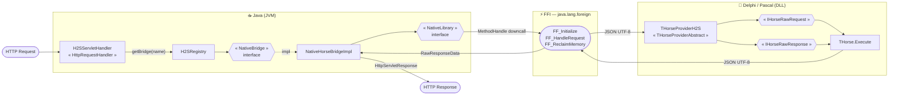

# Horse Java Servlet Provider (H2S)

Biblioteca que permite expor rotas do framework [Horse](https://github.com/HashLoad/horse) (Delphi/Pascal) como endpoints de uma aplicação Java com Servlet (ex: Spring Boot).

A comunicação ocorre via **FFI nativa** (Foreign Function Interface), sem rede, com troca de dados em JSON via memória.

---

> [!IMPORTANT]
> **Compatibilidade com HORSE_ISAPI**
>
> Na fase inicial de testes, este provider utiliza a **mesma diretiva de compilação** do `HORSE_ISAPI`.
> Certifique-se de que a diretiva `HORSE_ISAPI` **não está ativa** no seu projeto simultaneamente, pois ambos compartilham a mesma interface de provider e podem gerar conflitos de compilação ou comportamento inesperado.

---

## Versões Requeridas

| Tecnologia | Versão mínima | Motivo |
|---|---|---|
| **Java** | 22+ | Uso de `java.lang.foreign` (FFM API estável) para chamadas nativas sem JNI |
| **Horse** | 3.x+ | Suporte à interface `THorseProviderAbstract` e `Horse.Provider.RawInterfaces` |
| **Delphi** | 10.4 Sydney+ | Uso de `TJsonSerializer`, inline var e diretivas de compilação compatíveis |
| **Jakarta Servlet** | 5.0+ (jakarta.*) | Pacote `jakarta.servlet` — não compatível com `javax.servlet` |

---

## Funcionalidades

- **Múltiplas DLLs** registradas simultaneamente via `H2SRegistry`, cada uma com um nome de rota
- **Roteamento automático** — toda requisição em `/h2s/{nome}/{rota}` é despachada para a DLL correspondente
- **Zero rede** — a comunicação Java ↔ Delphi é feita por chamada direta de função em memória
- **Gerenciamento de memória seguro** — a DLL aloca e libera sua própria memória via `FF_ReclaimMemory`
- **Compatível com Spring Boot** — o handler é um `@Component` detectado automaticamente
- **Tratamento de erros** — exceções nativas retornam status `569` e são convertidas em `NativeLibraryException`
- **Suporte a headers, cookies, query params e body** — todos extraídos do `HttpServletRequest` e repassados à DLL

---

## Arquitetura




---

## Estrutura do Projeto

```
horse-java-servlet-provider/
├── src/
│   ├── horse-provider/              # Lado Delphi
│   │   ├── H2S.pas                  # Provider principal + funções exportadas
│   │   ├── H2S.Pipeline.pas         # Contexto de pipeline (Request/Response)
│   │   ├── H2S.Request.pas          # Adapta TRawRequestData → IHorseRawRequest
│   │   ├── H2S.Response.pas         # Adapta resposta Horse → TRawResponseData
│   │   └── H2S.Payload.pas          # Records de contrato (request/response)
│   │
│   └── servlet-native-adapter/      # Lado Java
│       ├── H2SServletHandler.java   # Entry point HTTP (Spring @Component)
│       ├── H2SRegistry.java         # Registro e lookup de DLLs
│       ├── NativeHorseBridgeImpl.java     # Invoca funções nativas da DLL
│       ├── NativeLibraryBinderImpl.java   # Carrega DLL e vincula MethodHandles
│       ├── HttpServletRequestAdapter.java # HttpServletRequest → RawRequestData
│       ├── RawRequestData.java      # Record JSON de entrada
│       └── RawResponseData.java     # Record JSON de saída
│
└── example/
    ├── HorseConnectAPI.dpr                  # Exemplo de DLL Delphi com rotas Horse
    └── HorseConnectSpringApplication.java   # Exemplo de app Spring Boot
```

---

## Protocolo de Comunicação

A troca de dados entre Java e Delphi usa JSON com chaves abreviadas para minimizar o payload:

| Campo | Chave JSON | Direção |
|---|---|---|
| Body | `b` | → e ← |
| Method | `m_t` | → |
| Path | `p_i`, `f_p` | → |
| Query string | `q_s`, `q_kv` | → |
| Headers | `h_kv` | → |
| Cookies | `c_kv` | → |
| Status code | `s_c` | ← |
| Content-Type | `c_t` | → e ← |

---

## Uso Básico

### 1. DLL Delphi (`HorseConnectAPI.dpr`)

```pascal
library HorseConnectAPI;

uses H2S, Horse;

procedure Initialize();
begin
  THorse.Get('/welcome', procedure (Req: THorseRequest; Res: THorseResponse)
  begin
    Res.Status(THTTPStatus.OK).Send('Olá, ' + Req.Query.Field('username').AsString);
  end);
end;

begin
  GH2SInitializeProc := Initialize;
end.
```

### 2. App Spring Boot (`HorseConnectSpringApplication.java`)

```java
@SpringBootApplication
@ComponentScan(basePackages = "io.h2s")
public class HorseConnectSpringApplication {
    public static void main(String[] args) {
        H2SRegistry.register("horse-connect", Path.of("C:\\temp\\HorseConnectAPI.dll"));
        SpringApplication.run(HorseConnectSpringApplication.class, args);
    }
}
```

As rotas da DLL ficam disponíveis em:

```
GET /h2s/horse-connect/welcome?username=Mundo
```

---

## Funções Exportadas pela DLL

| Função | Assinatura C | Descrição |
|---|---|---|
| `FF_Initialize` | `int FF_Initialize()` | Inicializa a DLL e registra as rotas Horse |
| `FF_HandleRequest` | `char* FF_HandleRequest(char* requestJson)` | Processa uma requisição e retorna JSON de resposta |
| `FF_ReclaimMemory` | `void FF_ReclaimMemory(char* ptr)` | Libera a memória alocada pela DLL |
